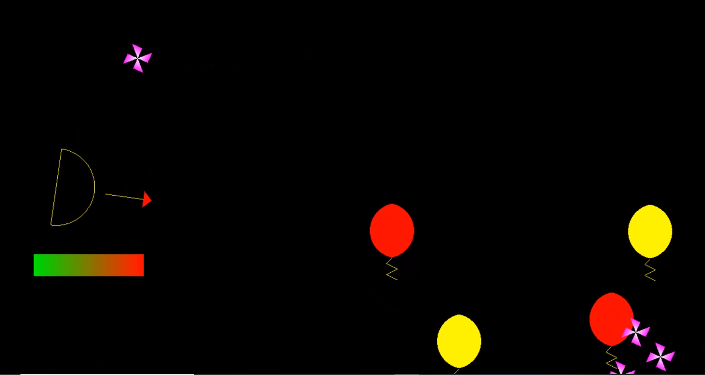

# ArrowShooter
2D arrow shooting game developed in OpenGL.

In this application, the player controls an arrow and has to shoot at as many balloons as possible, while also avoiding the flying shurikens.

**Notes**
* The main code of the application is in: "Source/Laboratoare/Tema1".
* During this university project, I learned how to manualy create and work with 2D meshes and control the mouse. 

